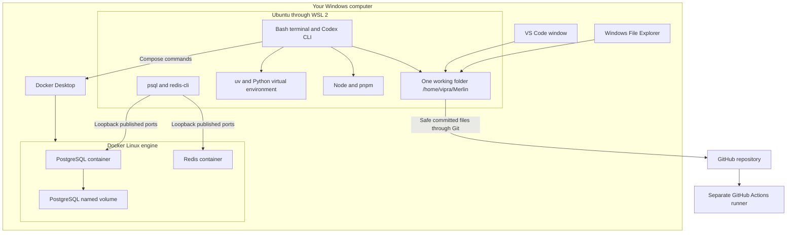
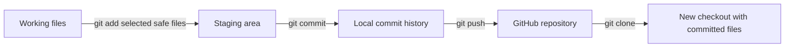
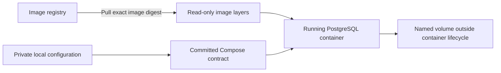
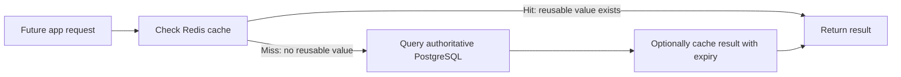
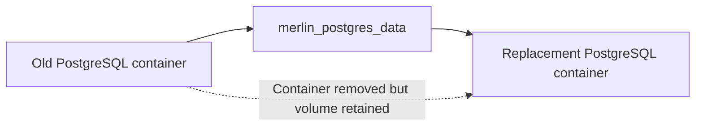
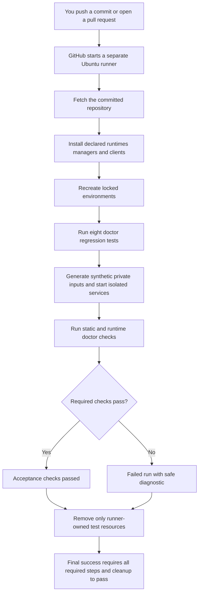
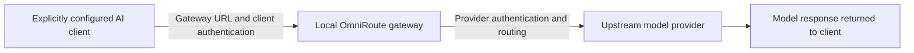

# Sprint 0 learning guide — see how your environment works

This guide covers the setup tools, the checks we performed, the new automation, and the optional agent tooling. It explains what each piece does, why we chose it, and what you should be able to explain. It is a learning guide, not a claim that the application is built or that you have mastered every topic.

**Start here:** read the two diagrams, then Section 8 on CI and Section 7 on the new scripts. Use the other sections as a reference. The diagrams render in GitHub and VS Code Markdown Preview (`Ctrl+Shift+V`); the text underneath explains them if your viewer does not render Mermaid. Reading is inside your existing learning time, not extra invisible project hours.

Your October 6 answers correctly identify that `.env` is private and absent from a clone, and that health does not prove authentication. To finish the first answer, add why the setup instructions/configuration must be committed. To finish the second, explain how unchanged volume/cluster identity proves retention. CI was unfamiliar; Section 8 teaches it before asking you to explain it. Your 34/35 quiz result remains learner-reported evidence, not blanket practical mastery. Actual setup minutes are recorded as **unknown**; DSA remains deferred.

## 1. The whole environment: where each thing lives



**Read the picture:** Windows is your physical host. Ubuntu is your Linux development environment. VS Code's window is on Windows, but its WSL server, terminal and project tools operate in Ubuntu. Docker Desktop supplies the Linux container engine; the database processes run in containers. GitHub stores committed source and runs independent checks. Its runner does not use your private laptop database.

This is one active folder with two ways to view it, not two synchronized copies:

| View | Address | What it accesses |
|---|---|---|
| Ubuntu terminal / Codex | `/home/vipra/Merlin` | The canonical working checkout |
| Windows Explorer | `\\wsl.localhost\Ubuntu\home\vipra\Merlin` | Those same Ubuntu files |
| Older Windows folder | `C:\Users\vipra\Merlin` | A retained stale copy; not the active project |

Open Explorer with `Win+E`, press `Ctrl+L`, paste the Ubuntu share address and press Enter. Open Markdown in VS Code and press `Ctrl+Shift+V` for diagrams. See [all terminal commands](TERMINAL_COMMANDS.md) and [setup instructions](../SETUP.md).

### Ubuntu, WSL, Windows, Bash and VS Code

| Name | Meaning | Why it is here / what to remember |
|---|---|---|
| Windows | Your host operating system: desktop, hardware and Windows applications. | It runs the editor interface and Docker Desktop. You do not have to replace Windows to develop in Linux. |
| Ubuntu | A Linux distribution: Linux plus system packages and utilities. | Our project paths, permissions and tool processes use Linux conventions. Linux development reduces differences from Linux containers/servers. It does not guarantee that every device or iOS can run the app. |
| WSL 2 | Windows Subsystem for Linux, using a real Linux kernel in a managed virtual machine. | It lets Ubuntu run alongside Windows. A WSL environment and an individual Docker container are different boundaries. |
| Bash | The shell interpreting commands in the Ubuntu terminal. | It resolves programs through PATH and starts processes. PowerShell is a different Windows shell; do not mix their path or quoting syntax. |
| VS Code WSL extension / VS Code Server | The bridge between the Windows editor and Ubuntu-side editing/tools. | The `WSL: Ubuntu` indicator confirms the intended connection. `code .` opens the current directory. |
| Python extension, Pylance and debugger | Editor support for interpreter selection, analysis/completion and stepping through execution. | They help you work; they do not replace Python or install all backend packages. |
| RAM, swap, disk and GPU | Different hardware resources: active memory, disk-backed memory, storage capacity and a specialized processor. | WSL's RAM allocation differs from total Windows RAM. Virtual-disk free space does not prove equal backing-disk capacity. GPU visibility does not prove CUDA/model inference works. |

The observed machine has roughly 16 GB host RAM and an RTX 3050 with 4 GB VRAM. Preserve the dated hardware evidence in Part 04/17; do not advertise model performance from those specifications. Swap can help memory pressure but is slower than RAM. Keep enough Windows backing-disk capacity for WSL and Docker data.

**Interview explanation:** “I develop in one Ubuntu checkout through WSL to keep Linux tools, permissions and container workflows consistent, while retaining my Windows desktop. I still test portability rather than assuming it.”

📚 Learn first: [WSL filesystems](https://learn.microsoft.com/en-us/windows/wsl/filesystems), Windows/Linux file access; [VS Code WSL](https://code.visualstudio.com/docs/remote/wsl), opening a folder; stop before optional customization.
↩ Return: locate the same file through Explorer and the Ubuntu terminal, then explain where the editor, tools and data run. Do this within the existing learning block.

## 2. Git, GitHub, accounts and Jira

### Version control: local history versus publication



Git is the local version-control tool. GitHub hosts a remote repository and related services. Editing a file does not automatically put it in Git history. Staging chooses what goes into the next commit. A commit records a snapshot of tracked content, its parent/history and metadata; its hash identifies that commit. Pushing publishes commits to the remote. Cloning creates a new local repository from committed remote history. Pulling fetches and integrates remote changes; it can require resolving conflicts.

A branch names a moving line of development, so work can be reviewed separately. A pull request proposes changes for review; it is not a push and not an automatic merge. Git identity records author information; it is not account authentication. `.gitignore` avoids tracking selected local files, but does not erase already tracked files or remove exposed secrets from old history. Never assume a committed secret is safe because you later ignored it.

Current setup work is on `setup/E0-US01-environment`; local checklist IDs are not issued Jira tickets. Do not invent a `MER-123` issue key. There is no automatic two-way sync with the old Windows copy. Review `git status` and the intended diff before publishing.

### Three different security concepts

| Concept | What it does | What it does not prove |
|---|---|---|
| SSH key authentication | GitHub checks possession of the corresponding private key for SSH Git operations. The public key may be registered with GitHub; keep the private key private. | It does not authenticate Jira, and does not establish GitHub browser MFA. |
| Browser login and MFA | Your account uses a password plus another factor, such as an authenticator code. MFA resists use of a stolen password. | It does not stop every attack or protect unrelated accounts automatically. |
| Recovery material | A private recovery mechanism helps regain access if your second factor is unavailable. | Publishing it undermines account security. Record only that it is stored privately. |

Jira is the work-tracking application, not part of the app's runtime. Your Atlassian site is `https://vipravlipare.atlassian.net`, space key `MER`, learner-confirmed **Free, team-managed Scrum**. Email verification, personal MFA, successful sign-in and recovery storage were previously confirmed. GitHub is reported configured; browser MFA has not been explicitly confirmed independently. Software tests cannot prove that personal setting.

Scrum organizes work into bounded sprints and reviews. A backlog holds future items; acceptance criteria define an observable result. Our written WIP limit is two active items. Stand-up records progress, blocker and next action; retrospective records what to change in the process. Planned time is not actual time. Unknown actual minutes remain unknown, and setup spill replaces equal feature minutes instead of extending the day. AWS signup/payment/CLI/deployment is deferred; a billing alert would not be a hard spending cap.

**Interview explanation:** “Git gives reviewable history and recovery; GitHub provides collaboration and automated checks. Jira makes scope and acceptance visible. They solve different problems and need their own account security.”

📚 Learn first: [Git recording changes](https://git-scm.com/book/en/v2/Git-Basics-Recording-Changes-to-the-Repository), tracked/staged files; [GitHub SSH](https://docs.github.com/en/authentication/connecting-to-github-with-ssh), key authentication; stop before account administration.
↩ Return: describe commit, push and clone, identify one ignored private file, and explain why Jira still needs its own MFA. Do not publish keys or recovery codes.

## 3. Python, Node, package managers, environments and locks

Python executes Python programs; Node executes JavaScript outside a browser. They are runtimes, not the backend application itself. The planned backend will use Python; Node supports future frontend development/build tooling. Neither Python nor Node alone implements routes, login or business behavior.

| File/tool | Responsibility | Beginner example |
|---|---|---|
| `uv` | Select/manage Python and create/install a project's environment and resolved dependencies. | It gets the declared environment ready before executing Python. |
| `.venv/` | A local Python environment with an interpreter and installed packages. | Different projects can use different dependencies without sharing one global installation. It is regenerated, not committed. |
| `.python-version` | The project's requested Python version. | It helps uv select Python 3.12. |
| `pyproject.toml` | Python project metadata, supported Python constraint and dependency declarations. | “This project requires Python 3.12.” Currently no feature packages are declared. |
| `uv.lock` | The resolved Python dependency graph and relevant metadata. | Locked installs use the committed resolution instead of selecting new versions silently. |
| `pnpm` | JavaScript package manager. | It installs the dependencies declared by `package.json`. It is not the Node runtime. |
| `package.json` | JavaScript project metadata, dependency declarations, scripts and package-manager pin. | It declares pnpm 12.8.1; the existing test command is still a failing placeholder, not an app test. |
| `pnpm-lock.yaml` | Resolved JavaScript package-manager/dependency information. | Frozen installation must agree with the committed file. |
| `node_modules/` | Local installed JavaScript packages. | It is recreated from metadata/locks, not committed. |
| PATH | The ordered directories the shell searches for executables. | A wrong PATH can choose a different Python, Windows client or package manager. |

Observed versions: uv 0.12.21, Python 3.12.14, Node 24.21.0 and pnpm 12.8.1. LTS means a release line with longer support; it does not mean “latest forever.” Constraints, runtime pins and dependency locks have different purposes. A lockfile reduces dependency drift, but is not a guarantee of identical hardware, safe packages or a working application.

`uv sync --locked` recreates the declared Python environment and refuses an inconsistent lock. `uv run --locked python ...` runs Python in that environment. `pnpm install --frozen-lockfile --ignore-scripts` uses the existing lock and disables project package lifecycle scripts. We fixed the incomplete pnpm lock through its own manager and verified frozen installation; we did not add frontend features.

**Interview explanation:** “I separate runtimes from package managers and commit dependency locks so another checkout can recreate the same declared resolution. I test installation instead of assuming a lockfile guarantees compatibility.”

📚 Learn first: [uv locking/syncing](https://docs.astral.sh/uv/concepts/projects/sync/), locked installs; [pnpm installation](https://pnpm.io/installation), supported setup; stop before feature dependencies.
↩ Return: identify which files are committed and which directories are regenerated, then explain why uv is not your API. Resolve application packages only at funded first use.

## 4. Docker images, containers and Compose

Think of an image as a prepared package and a container as a running instance of it. An image includes filesystem content, binaries, libraries and startup metadata. It is not a complete physical computer or a separate running operating system. Containers use a host kernel; a virtual machine has its own guest kernel. Linux containers on your Windows machine use the Linux environment supplied by Docker's backend.



Docker's CLI sends requests to an engine that creates/runs containers. Docker Desktop provides the engine/integration on this host. An image registry distributes images; `docker pull` fetches them. An image **tag** is a readable label; a **digest** identifies immutable image content. Our `version@sha256:...` references keep both a readable release and an exact content identifier. A pin prevents silent drift; it does not promise vulnerability-free software or remove the need to review future updates.

Compose reads `docker-compose.yml`, a YAML configuration file. It declares two services, their images, ports, environment inputs, health probes, limits, logs, networks and volumes. One command can bring up that declared stack. It does not create application features or verify all security by itself. A project name groups resources; service names `postgres` and `redis` give containers stable DNS names on their Compose network. Container IDs/names can change during recreation.

### Our configuration and why each field matters

| Choice | Current setup | Reason / trade-off |
|---|---|---|
| Server images | PostgreSQL 17.11 bookworm; Redis 8.10.2 trixie, both with exact digests | Known tested inputs rather than floating image tags. |
| Service boundaries | `postgres` and `redis`; no application placeholder | Each process has a clear job. Database startup is not an API implementation. |
| Health checks | Readiness/PONG; 30-second start period; 10-second interval, 5-second timeout, 5 retries | Allow startup time, then observe availability. A start period is not a guarantee the service is ready after 30 seconds. |
| Resource ceilings | PostgreSQL 1 GiB/1 CPU; Redis 256 MiB/0.5 CPU | Bound service use on the laptop. CPU limits cap execution time; they do not reserve a dedicated physical core. Memory exhaustion can kill or reject work. |
| Redis data limit | 128 MiB, `noeviction` | Bound data use separately from total process memory. At the limit, additional memory-growing writes may fail rather than evict existing keys. |
| Logs | `json-file`, `10m` maximum file size, 3 files | Rotate logs so they cannot grow without a bound. Logs can still contain secrets; review/redact before publication. |
| Lifecycle | `unless-stopped`, graceful stop allowance 30 seconds | Restart behavior is explicit; manually stopped containers are not claimed automatically running. |
| Process ownership | Main processes observed UID 999, non-root | Reduces process privilege inside the container. This is not complete container isolation or production security. |
| Project identity | Original defaults to `merlin`; helper creates a different identity for a new clone | Scope containers/networks/volumes so a test cannot accidentally own the working database. |

`docker compose config --quiet` validates configuration without printing resolved secrets. `up --wait` creates/starts and waits for health within a timeout. `ps` lists services/status. `port` shows a published endpoint. `stop` stops containers and keeps them; ordinary `down` removes containers/network and retains named volumes. **Never use volume-removal cleanup against your original database.**

**Interview explanation:** “Compose gives me a versioned local infrastructure contract. Exact images, loopback bindings, resource limits and bounded logs keep the setup predictable and restrained without introducing Kubernetes before it is justified.”

📚 Learn first: [Compose model](https://docs.docker.com/compose/intro/compose-application-model/), services/networks/volumes; [Compose services](https://docs.docker.com/reference/compose-file/services/), health/resources/logging; stop before deployment examples.
↩ Return: find each contract field in the Compose file and explain its purpose. Review safely; do not print the resolved configuration.

## 5. PostgreSQL, relational storage and Redis

### PostgreSQL: server, database, table and client

PostgreSQL is a database management server. It receives commands from clients, authenticates connections, executes queries, enforces rules and manages stored data. A server installation can contain several databases. Each database can contain schemas, tables, indexes and other objects. Our data directory is a PostgreSQL **cluster**: a collection of databases managed by this server instance, not a multi-machine distributed cluster.

`psql` is a command-line **client**, not the server or the app backend. A future Python driver will be another client. Clients send SQL, the language used to request/query/change relational data. The server sends results back. We use native Ubuntu clients to test the published host ports, as well as clients inside the container to test service-network access. Client and server versions need compatible protocols; they do not have to be identical numbers.

```text
Future example — these application tables are NOT built yet:

USERS                         NOTES
id   name                     id   owner_id   title
7    Asha                     51   7          Docker notes
9    Sam                      52   9          SQL notes

users.id: primary key identifying a user
notes.owner_id: foreign key referring to a user
A join can connect note 51 to user 7.
```

A **row** is one record; a **column** is one named attribute. A primary key identifies a row; a foreign key expresses a valid relationship. Constraints reject invalid data, such as a missing required value or an invalid reference. An index helps certain lookups but consumes storage and adds work on writes; index selection needs measured queries. A join combines related records. A schema defines organization and rules; a migration is a reviewed versioned change to that structure. These concepts are planned for Sprint 1, not completed setup features.

A transaction groups operations: **commit** makes its changes durable according to the configured durability behavior; **rollback** abandons uncommitted changes. PostgreSQL uses buffering and a write-ahead log to support recovery; data is not simply “one SQL text file per table.” ACID describes atomicity, consistency, isolation and durability. Actual isolation/security/backup behavior still requires deliberate design and testing. Database password authentication answers who can connect; future app authorization must also answer whose notes they can read/change. A setup administrative role does not prove per-user isolation.

### Types of storage: choose by access pattern

| Storage type | Shape and example | A typical reason to use it | Our current status |
|---|---|---|---|
| Relational | Tables with keys and relationships; PostgreSQL | Related users/notes/tasks, constraints and transactions | Server running; app tables not built |
| Key-value | Key points to a value/data structure; Redis | Fast lookup, expiring reusable results or counters | Disposable service smoke-tested; no app cache |
| Document | Documents with nested fields; MongoDB | Flexible document-shaped records | Deferred, no installation/feature claim |
| Object | Objects retrieved by key; S3 or compatible object storage | Uploaded files/blobs and attachments | Cloud use deferred |
| Filesystem | Files/directories on a local disk or mounted volume | Source files, logs and database-managed files | Used by Ubuntu/Docker |
| Vector search | Numerical embeddings searched by similarity; pgvector | Future semantic retrieval over notes | Planned extension/use; not installed here |
| Graph | Nodes and edges; a graph database | Relationship/path-heavy queries | Concept only; a separate database not installed |

These categories can overlap: PostgreSQL can store JSON, and a database may offer vector features. “NoSQL” is a broad family, not one storage shape and not automatically faster or better. A Docker volume is a storage mechanism for files, not a relational/key-value database engine.

### Redis and caching

Redis stores keys and data structures primarily in memory. Caching means keeping a reusable result so a later request avoids repeated expensive work. Example: calculate a public dashboard count, cache it briefly, and reuse it until expiry. A **TTL** is a time-to-live: how long a cached entry may remain. Cache invalidation decides when a result has become stale. Cache misses, eviction, failure and stampedes need thought when the application starts using a cache.



**This diagram is a future design example, not implemented Merlin behavior.** PostgreSQL remains the planned source of truth for durable records. Redis can accelerate a justified access pattern, but adds stale-data and failure considerations. We have not built a cache or queue. `PING`/`PONG` proves the server responded, not that caching works.

Redis can be configured to persist data, but ours explicitly disables snapshot saves and append-only-file writes. Its mount does not make in-memory keys survive process recreation. It is intentionally disposable for local synthetic smoke testing. The configured `noeviction` policy is not an LRU policy; future embedding LRU work was discussed but is not implemented, and DSA study is deferred.

**Interview explanation:** “I choose PostgreSQL for authoritative related data and transactions. Redis is available for later measured caching, but I do not depend on a disposable cache for data I cannot reconstruct.”

📚 Learn first: [PostgreSQL tutorial](https://www.postgresql.org/docs/17/tutorial.html), architecture/tables/queries; [PostgreSQL transactions](https://www.postgresql.org/docs/17/tutorial-transactions.html), commit/rollback; [Redis CLI](https://redis.io/docs/latest/develop/tools/cli/), PING; stop before application implementation.
↩ Return: label client, server, database and volume in your own drawing, then explain which data must survive Redis loss. App schemas and drivers remain learner-written Sprint 1 work.

## 6. Named volumes, ports and private configuration

### A named volume survives the container



A named volume is Docker-managed storage attached at a container path. PostgreSQL writes its managed files at `/var/lib/postgresql/data`; the volume supplies storage there. Ordinary container removal and volume removal are different operations. A replacement container can attach the same volume, so the existing cluster returns. Container IDs may change; the volume name and PostgreSQL cluster identifier must match the recorded baseline for a retention test.

Our original identity is volume `merlin_postgres_data`, cluster `7691749973399031842`. A clean independent clone should have a **different** volume and cluster. After recreating that clone's containers, its own cluster should stay the **same**. Cluster identity proves this setup reused the cluster; it does not verify every future business record or perform a backup restore.

A backup is a separate recoverable copy. A named volume can be damaged/deleted or lost with its host. Keeping one volume is not a backup strategy. A temporary local dump is not automatically durable or restored/tested. Do not delete your database volume to fix a login problem.

### Loopback, ports and service DNS

Read `127.0.0.1:5432:5432` as **host address : host port : container port**.

```text
Ubuntu psql client
  | connects to local address 127.0.0.1, published port 5432
  v
Docker port mapping
  | forwards traffic
  v
PostgreSQL container listening on port 5432

A future container client on the same Compose network:
  postgres:5432  (service DNS, not the Ubuntu host address)
```

Loopback means the local machine/network namespace. `localhost` inside a container refers to that container, not another service. PostgreSQL's usual port is 5432; Redis's is 6379. A new clone can use another host port while keeping those container ports unchanged. A port is a numbered network endpoint, not a password or folder. Binding `0.0.0.0` accepts on all host interfaces; our published bindings use `127.0.0.1` to limit ordinary remote access. Local processes and Docker administrators remain inside the trust boundary; loopback is not complete authentication or production TLS.

### .env, .env.example, permissions and initialization

`.env` supplies private machine-specific configuration, including the local database password. `.env.example` records variable names with no usable password. Git contains the example and the Compose contract, but not the actual private file. Mode **0600** means the owner can read/write it and group/others have no permission bits. This does not keep Docker administrators from inspecting container environment values.

Compose reads `.env` for interpolation. VS Code's Python terminal environment-injection setting is separate; the warning that injection is disabled did not break Compose. Environment values are not a secret vault. Never print full resolved Compose configuration, dump all environment variables, paste credentials into arguments/history, or commit recovery material.

The image's initialization reads the password when creating an empty PostgreSQL data directory. The existing cluster stores its roles separately. Changing `.env` later changes the supplied input, not the stored role password. Proper rotation is a deliberate database operation; deleting storage is not a password-change procedure.

**Interview explanation:** “I separate replaceable containers from retained database files, and private configuration from versioned setup. Loopback reduces exposure; explicit authentication tests check the remaining access boundary.”

📚 Learn first: [Docker volumes](https://docs.docker.com/engine/storage/volumes/), lifecycle; [Compose services](https://docs.docker.com/reference/compose-file/services/), published ports; stop before destructive cleanup.
↩ Return: explain what remains after ordinary `down`, identify both sides of a port mapping, and explain why replacing `.env` does not rotate an existing password. Preserve the original volume.

## 7. New setup helper, doctor and verification evidence

### What was added, precisely

| Artifact | Job | What it does not do |
|---|---|---|
| Root `README.md` | Explain project purpose, current scope and where to start | Advertise an unbuilt app |
| `docs/SETUP.md` | Record prerequisites, repeatable startup, privacy and cleanup | Copy your private working environment into Git |
| `tools/setup_local.py` | Create private inputs if absent, validate quietly and start the two services | Overwrite an existing `.env`, rotate stored passwords, remove volumes or create app tables |
| `tools/doctor.py` | Diagnose setup and return a failing exit status for required failures | Start/stop services, repair data or certify application features |
| `tools/test_doctor.py` | Exercise diagnostic safety and meaningful failure handling | Test an unbuilt API |
| `.github/workflows/setup.yml` | Run independent setup checks automatically on GitHub | Deploy to AWS or use your laptop database |
| `TERMINAL_COMMANDS.md` | Give exact daily commands and Explorer access | Synchronize the old Windows copy |
| This guide | Teach boundaries, trade-offs and explain-back | Invent learner authorship or mastery |

The helper generates a random private local password and checkout-specific project/network/ports when `.env` is absent. Existing original configuration stays intact. Separate Compose project names scope the named volumes. It does not need a source/Compose edit for a new clone. New generated credentials are local synthetic setup inputs, not paid provider keys.

Doctor means “diagnostic program”: like a checklist that can actually run and say which required boundary failed. It checks Python/locks/managers, private-file handling, Compose validation, health, resources, logs, process ownership, mounts, positive/negative database access, observed cluster identity and Redis policy. It also uses native Ubuntu clients to test host access, so a container-internal success alone does not count as the full host test.

| Output | Meaning | Exit behavior |
|---|---|---|
| PASS | That specific observed check met its criterion | No failure added |
| WARN | A documented optional/not-applicable condition | Does not by itself fail the run |
| FAIL | A required criterion failed | Overall result is nonzero |

An exit code is a process's success/failure signal: normally 0 for success and nonzero for failure. CI uses it to stop a failing workflow. The doctor captures raw command output privately and prints safe reasons/fixes. A negative password test passes only if correct credentials succeed **and** the deliberately wrong password is explicitly rejected; a connection timeout is not evidence of password enforcement.

### Three separate questions, three separate proofs

```text
HEALTH                AUTHENTICATION             RETENTION
Can the service       Is the right password      Does the original data
respond to its        accepted and a wrong       cluster return after
readiness probe?      password rejected?         container recreation?

A new empty server can pass health and auth while failing retention.
A ready server can pass health while allowing unsafe access.
A retained volume can exist while the service is not running.
```

The eight diagnostic regression tests include secrecy, timeout handling, wrong-password failure classification, host credentials kept out of arguments, static mode avoiding runtime checks and acceptance of correctly isolated clone identities. They test the checker itself so it cannot casually turn an unrelated error into a green password-security result. They are infrastructure tests, not application tests.

`--static` checks setup prerequisites/configuration without requiring running services. Normal doctor execution checks runtime too. `--expect-cluster` compares against an explicit recorded baseline; use the original ID only in the original checkout. Logs/mount/resource evidence records observed facts, not passwords, resolved Compose output or private database dumps. Sanitized evidence means removing secret values while keeping enough context to assess the claim.

**Interview explanation:** “I automate repeatable diagnostics and test their failure behavior. I keep availability, credentials and retention as separate claims, with evidence for each.”

📚 Learn first: [Part 04 verification contract](part-04-environment-setup.md#s8-03--runtime-authentication-and-process-proof), expected outcomes; stop before optional installers.
↩ Return: run `uv run --locked python tools/doctor.py` in the Ubuntu checkout, pick one PASS and explain its exact limit. Do not treat the application N/A warning as an app test pass.

## 8. CI: the new concept, step by step

**CI means continuous integration:** automatically checking changes as they are published or proposed, so incompatible or broken changes are caught early. You do not have to remember every check yourself. GitHub Actions is the platform we use to run this automation. “Green CI” means one specific workflow run completed successfully on one specific commit, not that every possible test or app feature exists.



| CI word | Plain meaning | Our example |
|---|---|---|
| Event / trigger | Something that starts automation | Push, pull request or manual dispatch |
| Workflow | The committed automation recipe | `.github/workflows/setup.yml` |
| Runner | A machine executing the recipe | GitHub's Ubuntu 24.04 runner, separate from your WSL Ubuntu |
| Job | A group of steps executed on that runner | The `setup` job |
| Step | One ordered operation | Install tools, sync locks, run tests, start services |
| Action | Reusable automation from a repository | Checkout and runtime installers, pinned to exact commits |
| Check / run | The reported result of one execution | A dated success or failure tied to the commit |
| CI versus CD | Checking integration versus delivery/deployment | We built setup CI; no deployment pipeline is implemented |

The runner needs its own prerequisites because your laptop's `.venv`, clients and private `.env` are not in Git. It uses synthetic credentials and isolated disposable volumes. Our workflow has read-only repository permissions; it does not need an upstream model secret, real dump or AWS credentials. Its cleanup may remove **its own** disposable volumes; that is different from deleting the learner's retained original database.

The workflow pins Python 3.12.14, uv 0.12.21, Node 24.21.0, pnpm 12.8.1 and full action commit identifiers. Runner label `ubuntu-24.04` selects a supported image family; that runner image can still evolve. Pins reduce drift, and hosted execution tests what actually works together. We do not claim an unchanged operating-system image forever.

### Why we needed real CI instead of only local tests

Local checks passed, but hosted checks found two integration mistakes. An expression using `runner.temp` in an unsupported job-level environment location prevented any job from starting; we removed it. Then pnpm's installation with its own lifecycle scripts disabled left a shebangless placeholder: Bash could invoke it during package installation, but Python's direct diagnostic execution could not. We enabled **the pinned manager's installer outside the checkout** while leaving **project dependency lifecycle scripts disabled**. This is a good example of independent environments finding assumptions that a working laptop hides.

If CI is red, start with the first failed check, find evidence, fix the smallest responsible layer, publish again and observe the new run. Do not weaken version/password checks just to make the screen green. Runtime smoke tests are not comprehensive security, load, backup or application tests.

A green Merlin setup run means that the declared toolchain, locked setup, safe configuration and service checks worked on that runner for that commit. It does **not** prove login, notes/tasks, owner isolation, an API, a frontend, backups, performance, models or production deployment. Those checks need to be added as the learner builds their features.

**Interview explanation:** “I use CI to recreate and check setup independently on every push or pull request, with synthetic credentials and minimal permissions. A green setup workflow is evidence of the foundation, not a substitute for future feature tests.”

📚 Learn first: [Understanding GitHub Actions](https://docs.github.com/en/actions/get-started/understand-github-actions), workflows/jobs/steps/runners; stop before deployment tutorials.
↩ Return: open [Merlin Actions](https://github.com/vipravlipare/Merlin/actions), identify the commit and first failed/passing step, then explain which claims the run supports. See Part 17 for observed results rather than assuming the latest run is green.

## 9. Fresh clones and reproducibility

A project can work locally while a fresh clone fails because the working machine has hidden prerequisites: untracked source/configuration, ignored `.env`, installed dependencies, native clients, already-running services or existing database state. A clone gets committed history, not a copy of every local file/process.

```text
COMMITTED AND CLONED                PRIVATE OR REGENERATED
README and SETUP instructions      .env with this machine's password
Compose and example variable names .venv and node_modules
Project metadata and lockfiles     installed host tools/clients
Doctor, helper and CI recipe       database/cache contents
Planning documents and quiz        locally installed global agent skills
```

Reproducibility means another clean directory can follow declared prerequisites and committed instructions to produce an equivalent working setup. It does not mean sharing a password, having identical disk bytes or copying the original data directory. Our five project commands clone, enter the folder, sync Python, run the helper and run doctor. Installing host prerequisites happens separately and is explicitly documented; it is not secretly part of those five commands.

The fresh-clone test uses unchanged committed files, generates new private inputs and chooses independent resource identities. No local override or source patch is required. The exact tested commit, safe observed cluster, results and cleanup belong in Part 17. One retained laptop volume and one adapted temporary Compose configuration would not prove this documented path.

**Interview explanation:** “I test a real published clone to catch hidden working-directory dependencies. Its credentials and storage are independent, so the proof is safe and meaningful.”

📚 Learn first: [SETUP](../SETUP.md), prerequisites and five-command path; [Compose project model](https://docs.docker.com/compose/intro/compose-application-model/), project isolation; stop before cleanup commands.
↩ Return: name three things a clone does not carry and explain how setup supplies them safely. Never copy the original `.env` or reuse its volume for a disposable test.

## 10. Codex, ChatGPT, Caveman, agent skills and OmniRoute

### Instructions and skills are different from inference routing

Codex is an AI coding assistant available through local CLI and supported app/workflows. ChatGPT is the chat application; account settings and tool availability differ from local Codex filesystem configuration. A new Ubuntu Codex session can start with `codex -C /home/vipra/Merlin`; `-C` selects the working directory. `codex resume --last` resumes a previous session rather than starting a new one.

`AGENTS.md` supplies persistent project/user instructions. A skill is a named bundle of instructions, usually with a `SKILL.md`, sometimes with scripts/references. The agent loads the matching skill when relevant. Skills teach a workflow; they are not automatically a new running server, a connected provider or a model request. Project and global instructions can have different scopes. Files installed in Ubuntu/Windows do not automatically appear in every cloud device or ChatGPT account.

| Item used | Purpose | Boundary to understand |
|---|---|---|
| Caveman | Compress chat wording while preserving necessary facts | Files and beginner teaching remain normal English. Concise wording is not measured cost savings by itself. |
| Cavecrew | Compressed investigator/builder/reviewer delegation when applicable | Extra agents can still consume resources. Delegation does not prove an issue is fixed; review needs evidence. |
| Verification/review skills | Structure acceptance checks and read-only review | Installed instructions are not passing checks. Application code remains learner-owned under project rules. |
| OmniRoute skills | Instructions for providers, routing, compression, health and related operations | Load relevant skills only. Availability does not mean Codex requests use the gateway. |
| Global versus project skills | Shared user bundles versus this checkout's bundles | Global install improves local availability; it does not override unsupported app capabilities or per-project instructions. |

You do not need to memorize every installed skill name or all gateway APIs. You need to know what you invoked, its scope, and how to verify its outcome. Our local global Caveman/OmniRoute bundles are installed. Neither inspected Codex provider configuration was switched to OmniRoute; default Codex remains the working connection. ChatGPT-wide plugin/routing activation has not been established.

### Optional OmniRoute gateway: another service, not the app database



This diagram describes how routing would work when a client is configured and tested. It does not claim your current Codex uses that path. The installed gateway listens locally at port 20128; the dashboard and compatible API expose different operations. The installed release accepted both `/v1` and `/api/v1` prefixes in tests. `http://localhost:20128/api/v1` is a gateway base address, not an OpenAI-issued secret.

An API key authenticates a client/service. A **gateway client key** authorizes access to the local gateway; an **upstream provider credential** authorizes the gateway with the provider. They are separate keys with separate scopes. OAuth allows an authorization flow through the provider, rather than publishing a raw account password. Keep keys/tokens private and out of Git, chat, screenshots and logs. A valid credential does not prove quota, billing or a successful model response.

Routing selects an upstream provider/model or fallback. Compression may reduce inputs/outputs according to explicit settings; caching may reuse a result. A listed connection or saved compression setting does not prove a request used it, saved tokens or stayed free. Health probes test the gateway process, model smoke tests test responses, and tool-call tests check whether structured tool requests actually work. A chat reply can pass while tool use fails.

The optional user-level `systemd` service starts/stops the gateway; it is separate from Compose's PostgreSQL/Redis. `systemctl --user` operates your user services. Enabled startup does not promise Windows/WSL is always running. Current provider inventory and limitations are recorded in Part 17: some responses passed, some providers failed, and forced tool-call compatibility was not proved. No paid inference or permanent default-provider change was performed by this setup closure.

**Interview explanation:** “I keep agent instructions separate from the model connection. A local gateway can centralize provider routing, but I only claim routing or savings after testing the actual client path and measuring evidence.”

📚 Learn first: [Part 17 gateway evidence](part-17-sprint0.md#live-gateway-verification--october-6-follow-up), tested results and limits; [command reference](TERMINAL_COMMANDS.md), optional service commands; stop before replacing providers.
↩ Return: explain skill availability versus connected inference, and gateway-key versus provider-key. Do not change a working model connection or add paid services merely to complete Sprint 0.

## 11. What Sprint 0 accomplished—and what remains future work

Sprint 0 provides a repeatable, testable local foundation: one checkout, toolchain, versioned setup, secured personal-account practices, isolated database services, retained storage, diagnostic automation, published instructions and independent acceptance evidence. It makes future feature bugs easier to separate from setup bugs.

It does not build users/notes/tasks, migrations, authentication/authorization, FastAPI, React, pgvector, RAG, model evaluation, backup restore or production deployment. Redis is not yet an app cache. AWS and optional model/framework/platform installers remain deferred until funded first use. Scratch implementation comes before frameworks; future AI claims need a golden set, baseline, metric, latency and cost. Infrastructure supplied by the assistant should be described as reviewed/learned until you personally explain, modify and verify it; do not claim you authored every line.

For SWE, learn how to reproduce failures, read exit codes, review commits, manage dependencies and distinguish a check from its claim. For system design, learn responsibilities and boundaries: host versus container, client versus server, durable source of truth versus cache, private config versus versioned config, authentication versus authorization, local verification versus independent CI. Decisions have trade-offs and evidence, not just familiar product names.

### Interview mini-map

| Choice | One-sentence reason |
|---|---|
| Ubuntu/WSL | Consistent Linux tools and filesystem while retaining Windows. |
| Git/GitHub | Reviewable history, collaboration and identifiable tested commits. |
| Jira | Bounded scope, visible blockers and acceptance outcomes. |
| uv/pnpm and locks | Recreate declared dependency environments without silent drift. |
| Docker/Compose | Versioned repeatable service startup with explicit boundaries. |
| PostgreSQL | Authoritative related records, constraints and transactions. |
| Redis | Optional reusable results when measurement justifies a cache. |
| Named volumes | Database files outlive replaceable containers. |
| Private environment / loopback | Separate secrets from source and reduce network exposure. |
| Doctor / CI / fresh clone | Catch local setup failures, independent integration failures and hidden prerequisites. |
| Skills / optional gateway | Repeat relevant agent workflows; verify model routing independently. |

## 12. Visual practice and quick understanding checks

Draw this from memory on paper; label which parts exist now and which app features are future:

```text
Windows host
  Ubuntu working folder and tools
    Git committed inputs / private .env
    Compose network
      PostgreSQL process -> retained named volume
      Redis process -> disposable data
GitHub repository -> independent CI runner -> isolated test services
Optional AI client -> gateway -> provider (only when explicitly configured)
```

Answer these five questions in your own words, without copying the guide:

1. What does a fresh clone lack that the working directory may contain, and how do committed setup instructions supply it safely?
2. What do health, correct/wrong passwords and cluster retention each prove? Why can one pass while another fails?
3. Why can two clones use the same Compose file without sharing database data now?
4. What triggers CI, where does it run, and what does green setup CI not prove about Merlin?
5. Why is a retained named volume useful but not a backup? Why is an installed skill not proof of active inference routing?

Grade each answer: 0 missing/incorrect, 1 partly correct, 2 correct with the reason. Pass requires at least 8/10 with no unresolved secret-publication, authentication or destructive-cleanup misconception. Retest missed ideas. Draw host/container/storage boundaries in 60 seconds, then do a spaced re-quiz 2–3 days after understanding the missed concepts. Your existing [browser quiz](../../Quizzes/sprint-0-quiz.html) remains available; MCQ success complements rather than replaces explain-back.

📚 Learn first: the diagrams and Sections 7–9 above; stop before answers or new implementation.
↩ Return: provide your five short answers, record the grade and the drawing/re-quiz result in Part 17. Actual minutes may remain honestly unknown; DSA is not a required gate.

## 13. Small utilities and file formats you will encounter

These support tools are easy to confuse with application features. Learn their role before memorizing flags; exact safe commands are in the command reference.

| Name / concept | Meaning in this setup |
|---|---|
| CLI versus GUI | A command-line interface takes terminal commands; a graphical interface uses windows/buttons. Docker CLI and Docker Desktop control related infrastructure through different interfaces. |
| `cd`, `pwd`, `ls` | Change directory, show current directory, list files. A command often acts on the current working directory; choosing the wrong checkout matters. |
| `/`, `~`, `$HOME`, dotfiles | Linux root, your home directory shorthand, the home environment variable and names beginning with a dot. Hidden files such as `.env` still exist and need privacy protection. |
| `cat` and `rg` | Display text or search text/files. They are diagnostic utilities, not app dependencies. Do not display a private `.env` to create evidence. |
| `curl` | An HTTP client used for gateway/GitHub health or public diagnostic requests. A successful download is not proof of app correctness. Keep authorization headers out of shared logs. |
| HTTP, API and URL | HTTP carries requests/responses; an API defines operations a client can call; a URL locates an endpoint. A base URL, dashboard URL and API key have different jobs. |
| HTTP status codes | 200 indicates successful handling, 401 missing/invalid authentication, 403 refusal and 5xx a server/upstream failure. Interpret the actual response too; a 200 stream does not prove tool calls happened. |
| stdout, stderr, exit code | Normal output, error output and a process's numeric result. Capturing these privately lets doctor report a safe reason without printing a credential-bearing error. |
| `chmod 600` | Set owner-only read/write permissions. This does not encrypt the file or erase past Git exposure. |
| `apt` and `sudo` | Ubuntu's system package manager and a command for running with additional administrative permission. Host client installation is different from installing a project Python package. |
| Rootless client installation | Client binaries/libraries installed in the user's directories without changing the system package database. Native clients test real host access; they are not another database server. |
| `LD_LIBRARY_PATH` | Directories the loader searches for shared libraries. Our rootless client wrappers use their verified local libraries; these host files do not travel in a clone. |
| `npm` and Corepack | npm is another JavaScript package manager; it installs the pinned global pnpm tool in CI. Corepack is a package-manager launcher used by the existing local installation. Neither is the application's API. |
| Lifecycle script / executable wrapper | An installer may prepare a runnable executable. Disabling pnpm's own native installer caused the hosted diagnostic failure; disabling project dependency scripts remains a different policy. |
| YAML | Structured configuration text used for Compose and GitHub workflows. Indentation and supported expression locations matter. Valid-looking text can still violate a platform's schema. |
| TOML | Structured project configuration used in `pyproject.toml` and some tool settings. It declares metadata; it does not execute the application. |
| JSON | A structured data format used in APIs and selected Docker inspection output. Compare Redis key/value mappings by meaning rather than relying on incidental output order. |
| Markdown and HTML | Markdown is the learning/planning documentation format; HTML is the browser quiz format. Markdown diagrams need a renderer such as GitHub or VS Code Preview. |
| Digest, SHA-256 and commit hash | Content identifiers used for exact image/action/source references. Image digests and Git commit IDs identify different objects; a hash alone is not proof of safety. |
| Manifest | Image metadata describing content/platform variants. Inspecting a manifest selects a tested input; it does not run that image or prove its health. |
| UID | A numeric Linux user identity. UID999 observed for service processes is distinct from your Ubuntu login and from a PostgreSQL database role. |
| Docker context | The selected Docker engine endpoint. Running commands against the wrong context can inspect or change a different engine's resources. |
| `pg_isready` | PostgreSQL readiness probe. A ready response is not the required correct/wrong-password authentication proof. |
| `pg_controldata` / cluster identifier | Tools/metadata for the database cluster. We compared identity across container recreation; we did not execute a database repair or prove every future record. |
| `redis-cli`, PING and CONFIG | Redis client, response smoke test and configuration inspection. Policy observations do not implement an application cache. |
| `docker inspect`, `stats`, `logs`, `system df` | Inspect selected state, observe resources, view output or summarize Docker storage. Limit inspection and redact logs; unrestricted inspection can expose environment secrets. |
| `systemd` / user service | Service supervision for the optional local gateway. Starting that service is independent of Compose database startup. |
| Unit/regression test | A focused check of a behavior, including a past failure case. Our eight tests verify diagnostic boundaries; future application tests are separate. |
| Smoke / acceptance / negative test | A basic response check, a required-outcome check, or a deliberately invalid-input check. Each has a limited claim; none automatically replaces load/security/restore testing. |
| Evidence versus benchmark | A dated observed result versus a controlled performance comparison. An idle memory snapshot or one model response is not a production capacity/latency benchmark. |
| WIP, spill and go/no-go | Limit concurrent work, trade overrun against funded future work, and make a bounded readiness decision. Operational readiness does not fabricate mastery. |

📚 Learn first: [terminal reference](TERMINAL_COMMANDS.md), safe daily commands; [Part 04 evidence](part-04-environment-setup.md), selected inspections and resource limits; stop before optional installs.
↩ Return: choose five unfamiliar terms, point to where each was used, and explain which boundary it affects. Learn within the existing ritual/reading time; you do not need to memorize every CLI flag.

## Resource and coverage notes

This page covers Sprint 0's host/editor/hardware, shells, version control/accounts/Jira, runtimes/managers/locks, containers/Compose/resources/logs, SQL/storage/cache, secrets/networking, health/authentication/retention, evidence/rituals, new setup automation/CI/clone proof, and agent/gateway tooling. Optional future installers are explicitly not setup accomplishments. Exact observed acceptance/commit/run identities belong in Part 17 rather than a teaching claim.

Official Compose-model, PostgreSQL-tutorial, Redis-CLI and GitHub-Actions pages reopened October 6, 2026. WSL/filesystem/editor/Git/SSH/uv/pnpm references were inspected during the dated setup work; no new all-URLs audit is implied. Local doctor/helper/workflow and skill/gateway records were read directly. Context7 unavailable. Package security, optional provider quotas, future API compatibility and personal account facts need their own evidence.
